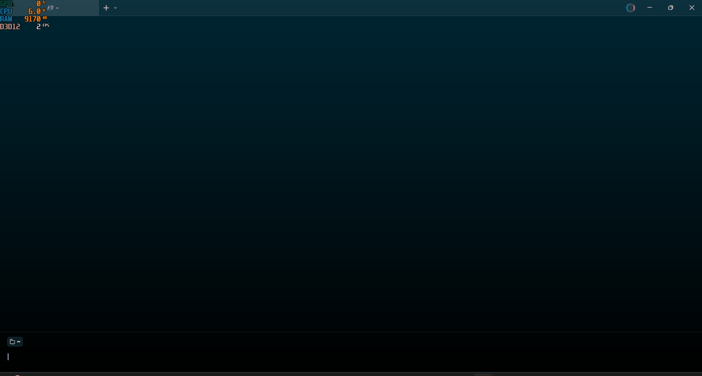

<div align="center">
  
</div>

# voragg-cli

Download anime episodes from streaming sites via the command line.

## Features

- **Anime-Sama support** - Downloads episodes from anime-sama.to series
- **Voir-anime support** - Downloads episodes from voir-anime.to series
- **15 supported players** - myTV, Vidmoly, Streamtape, Ansembed, Sibnet, oneupload, Sendvid, voe, filemoon, luluvdo, vidzy, uqload, embed4me, minochinos, movearnpre
- **HLS downloads** - Downloads `.m3u8` streams segment by segment
- **Direct downloads** - Downloads direct video files (e.g. MP4)
- **Quality selection** - `auto` picks the lowest available quality; `manual` prompts you per episode
- **Resumable downloads** - Partial files continue where they left off
- **Smart skipping** - Already-completed files are detected and skipped
- **Retry logic** - Up to 3 retries on failure
- **Concurrent downloads** - Configurable parallel downloads
- **Progress bars** - Per-file and overall download progress

## Getting started

### Prerequisites

- [Node.js](https://nodejs.org/) 18 or later

### Installation

Clone the repository and install dependencies:

```bash
git clone -b main https://github.com/laza-niaina/voragg-cli.git
cd voragg-cli
npm install
```

You can then run it directly:

```bash
node src/index.js <url> [options]
```

Or install it globally to use the `voragg` command from anywhere:

```bash
npm link
voragg <url> [options]
```

## CLI reference

### Usage

```
voragg <url> [options]
voragg sama <anime-sama-url> [options]
voragg voiranime <voir-anime-url> [options]
```

The `sama` and `voiranime` subcommands force the URL to be handled by the
matching platform and reject URLs from the other platform. The plain
`voragg <url>` command auto-detects the platform from the URL host.

### Arguments

| Argument | Description |
| -------- | ----------- |
| `url`    | URL to an anime series page or individual episode |

### Options

| Option                  | Default  | Description |
| ----------------------- | -------- | ----------- |
| `-o, --output <dir>`    | `.`      | Output directory for downloaded files |
| `-s, --start <number>`  | prompt   | First episode to process (runs to the end of the season unless `--end` is given) |
| `-e, --end <number>`    | end of season | Last episode to process, **inclusive** |
| `-t, --thread <number>` | `3`      | Max **concurrent** downloads (not a total episode count) |
| `-p, --player <name>`   | see below | Video player to use. Default: `ansembed` on anime-sama, `mytv` on voir-anime |
| `-q, --quality <label>` | none     | Video quality (e.g. `480`, `720`, `1080`); when unset, `-m auto` uses the lowest available |
| `-m, --mode <mode>`     | `manual` | Quality selection: `auto` (lowest) or `manual` (prompt) |
| `--debug`               | off      | Enable debug logging |
| `-h, --help`            |          | Show help |

### Episode selection

When `-s` is omitted, the CLI prompts for a selection. Three syntaxes are
accepted:

| Input      | Selection |
| ---------- | --------- |
| `61`       | episodes `61` to the end of the season (same as `-s 61`) |
| `61-69`    | episodes `61` to `69` **inclusive** (same as `-s 61 -e 69`) |
| `61,62,69` | exactly episodes `61`, `62` and `69` (no in-between episodes) |

Spaces around separators are tolerated (`61 - 69`, `61, 62, 69`). Invalid
inputs (`abc`, `61-`, `-69`, `69-61`, `61,,69`) are rejected and the prompt is
shown again. Selections are validated against the episodes actually present on
the site; requesting an episode that does not exist is an error.

`--start` / `--end` map directly to the range syntaxes:

```
-s 61            -> 61 to end of season
-s 61 -e 69      -> 61 to 69 inclusive
-e 69            -> first available episode to 69 inclusive
```

Important: `-t / --thread` only controls how many episodes are downloaded
**at the same time**. It never limits the number of episodes processed. With
`-s 61 -e 69 -t 3`, episodes 61 to 69 are all processed, three downloads
running in parallel at most.

### Examples

Download all episodes from an Anime-Sama series:

```
voragg sama https://anime-sama.to/catalogue/bleach/saison2/vf/ -p ansembed -q 480 -m auto -o ./downloads
```

Download episodes from a Voir-anime series with the myTV player:

```
voragg voiranime https://voir-anime.to/anime/shingeki-no-kyojin/ -p mytv -q 1080 -t 5
```

Download a single episode using auto-detection:

```
voragg https://voir-anime.to/anime/shingeki-no-kyojin/shingeki-no-kyojin-attaque-des-titans-25-vostfr/
```

Download a series with the Sibnet player:

```
voragg sama https://anime-sama.to/catalogue/bleach/saison2/vf/ -p sibnet -m auto
```

Download a bounded range of episodes (61 to 69 inclusive, 3 at a time):

```
voragg sama https://anime-sama.to/catalogue/bleach/saison2/vf/ -p ansembed -s 61 -e 69 -t 3 -m auto
```

Start at episode 61 and go to the end of the season, 5 downloads at a time:

```
voragg voiranime https://voir-anime.to/anime/shingeki-no-kyojin/ -p mytv -s 61 -t 5
```

## Supported platforms

| Platform | Players |
| -------- | ------- |
| [anime-sama.to](https://anime-sama.to) | Ansembed, Sibnet, oneupload, Sendvid, voe, filemoon, luluvdo, vidzy, uqload, embed4me, minochinos, movearnpre, myTV, Vidmoly, direct MP4 |
| [voir-anime.to](https://voir-anime.to) | Streamtape, myTV, Vidmoly |

## Requirements

- Node.js 18+

## License

MIT - see the [LICENSE](LICENSE) file for details.